 — public domain.](_static/fractio_panis.jpg){fig-alt="Fractio Panis — fresco from the Greek Chapel of the Catacomb of Priscilla, Rome, 2nd–4th century CE. Seven figures share bread and fish at a communal table."}

**Matristics** — from *mater*, by analogy with *patristics* — asks how well large language models know the women who shaped Christianity's first five centuries. We evaluate six frontier models — Claude, ChatGPT, Gemini, Grok, DeepSeek, and GLM — not only for factual accuracy, but for whether they reproduce the androcentric silences of the historical record itself. Read more in the [Background](background/index.qmd).

## Explore the project

```{=html}
<div class="ql-grid">
<a class="ql-card" href="figures/index.html">
<span class="ql-icon"><svg viewBox="0 0 24 24" fill="none" stroke="currentColor" stroke-width="1.8" stroke-linecap="round" stroke-linejoin="round"><circle cx="9" cy="8" r="3.2"/><path d="M3.5 19c0-3 2.5-5 5.5-5s5.5 2 5.5 5"/><circle cx="17" cy="9" r="2.4"/><path d="M15.8 14.3c2.7.2 4.7 2 4.7 4.7"/></svg></span>
<span class="ql-title">Figures &amp; Question Bank</span>
<span class="ql-desc">14 female figures and the two-tier question bank used to probe LLM knowledge.</span>
</a>
<a class="ql-card" href="methodology/rubric.html">
<span class="ql-icon"><svg viewBox="0 0 24 24" fill="none" stroke="currentColor" stroke-width="1.8" stroke-linecap="round" stroke-linejoin="round"><path d="M4 6l1.5 1.5L8 5"/><path d="M4 12l1.5 1.5L8 11"/><path d="M4 18l1.5 1.5L8 17"/><line x1="11" y1="6.5" x2="20" y2="6.5"/><line x1="11" y1="12.5" x2="20" y2="12.5"/><line x1="11" y1="18.5" x2="20" y2="18.5"/></svg></span>
<span class="ql-title">Evaluation Rubric</span>
<span class="ql-desc">Seven dimensions, from factual accuracy to gender bias.</span>
</a>
<a class="ql-card" href="data-collection/index.html">
<span class="ql-icon"><svg viewBox="0 0 24 24" fill="none" stroke="currentColor" stroke-width="1.8" stroke-linecap="round" stroke-linejoin="round"><ellipse cx="12" cy="5.5" rx="7.5" ry="3"/><path d="M4.5 5.5v6c0 1.7 3.4 3 7.5 3s7.5-1.3 7.5-3v-6"/><path d="M4.5 11.5v6c0 1.7 3.4 3 7.5 3s7.5-1.3 7.5-3v-6"/></svg></span>
<span class="ql-title">Data Collection</span>
<span class="ql-desc">API tutorials and notebooks for querying each model.</span>
</a>
<a class="ql-card" href="benchmark/index.html">
<span class="ql-icon"><svg viewBox="0 0 24 24" fill="none" stroke="currentColor" stroke-width="1.8" stroke-linecap="round" stroke-linejoin="round"><line x1="4" y1="20" x2="20" y2="20"/><rect x="6" y="11" width="3" height="6" rx="0.5"/><rect x="11" y="7" width="3" height="10" rx="0.5"/><rect x="16" y="13" width="3" height="4" rx="0.5"/></svg></span>
<span class="ql-title">Benchmark</span>
<span class="ql-desc">First results: six models, 420 ratings, by figure and dimension.</span>
</a>
<a class="ql-card" href="replicate/index.html">
<span class="ql-icon"><svg viewBox="0 0 24 24" fill="none" stroke="currentColor" stroke-width="1.8" stroke-linecap="round" stroke-linejoin="round"><path d="M20 11a8 8 0 0 0-14.9-3"/><path d="M4 5v4h4"/><path d="M4 13a8 8 0 0 0 14.9 3"/><path d="M20 19v-4h-4"/></svg></span>
<span class="ql-title">Replicate This Study</span>
<span class="ql-desc">Everything you need to run the evaluation yourself.</span>
</a>
</div>
```

## Figures under investigation

The project begins with two figures and will expand as research progresses. Use the arrows to browse.

```{=html}
<div class="fig-carousel-wrap">
<button class="fig-nav fig-prev" aria-label="Scroll figures left">&#8249;</button>
<div class="fig-carousel" id="figCarousel" tabindex="0" aria-label="Female figures under investigation">
  <a class="fig-card active" href="figures/macrina.html">
    <span class="fig-portrait">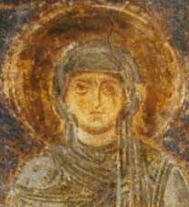</span>
    <span class="fig-name">Macrina the Younger</span>
    <span class="fig-period">c. 327–379 CE</span>
    <span class="fig-status status-active">Active</span>
  </a>
  <a class="fig-card active" href="figures/olympias.html">
    <span class="fig-portrait">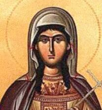</span>
    <span class="fig-name">Olympias of Constantinople</span>
    <span class="fig-period">c. 360–408 CE</span>
    <span class="fig-status status-active">Active</span>
  </a>
  <div class="fig-card planned">
    <span class="fig-portrait">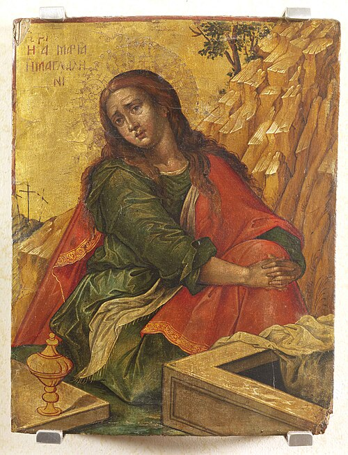</span>
    <span class="fig-name">Mary Magdalene</span>
    <span class="fig-period">1st c. CE</span>
    <span class="fig-status status-planned">Planned</span>
  </div>
  <div class="fig-card planned">
    <span class="fig-portrait">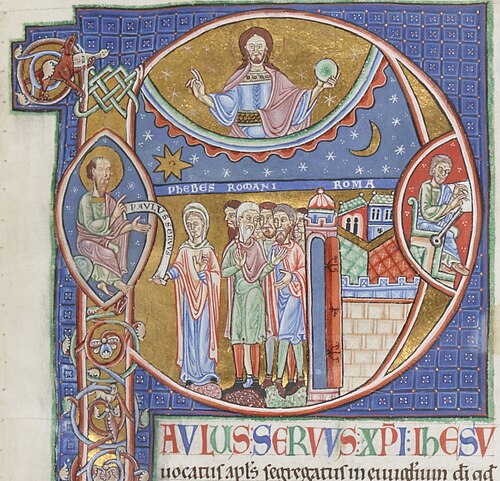</span>
    <span class="fig-name">Phoebe of Cenchreae</span>
    <span class="fig-period">1st c. CE</span>
    <span class="fig-status status-planned">Planned</span>
  </div>
  <div class="fig-card planned">
    <span class="fig-portrait">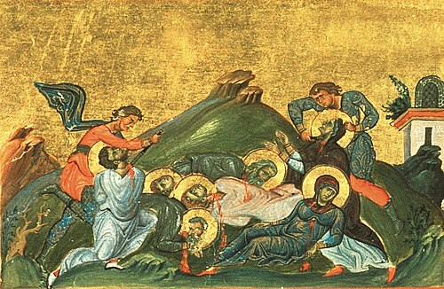</span>
    <span class="fig-name">Perpetua &amp; Felicitas</span>
    <span class="fig-period">d. 203 CE</span>
    <span class="fig-status status-planned">Planned</span>
  </div>
  <div class="fig-card planned">
    <span class="fig-portrait">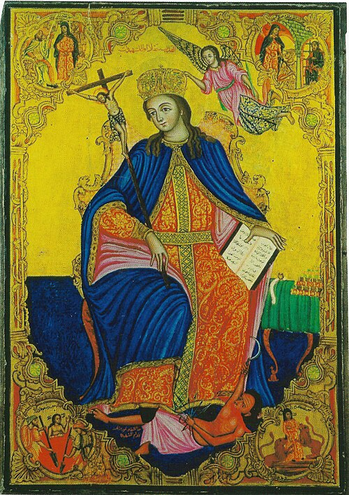</span>
    <span class="fig-name">Thecla</span>
    <span class="fig-period">1st–2nd c. CE</span>
    <span class="fig-status status-planned">Planned</span>
  </div>
  <div class="fig-card planned">
    <span class="fig-portrait"></span>
    <span class="fig-name">Junia</span>
    <span class="fig-period">1st c. CE</span>
    <span class="fig-status status-planned">Planned</span>
  </div>
  <div class="fig-card planned">
    <span class="fig-portrait">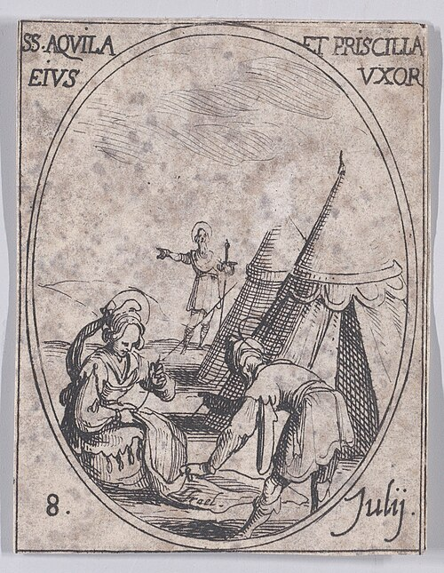</span>
    <span class="fig-name">Priscilla / Prisca</span>
    <span class="fig-period">1st c. CE</span>
    <span class="fig-status status-planned">Planned</span>
  </div>
  <div class="fig-card planned">
    <span class="fig-portrait">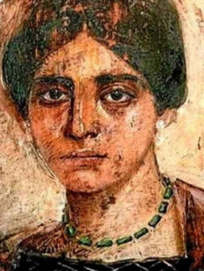</span>
    <span class="fig-name">Egeria</span>
    <span class="fig-period">4th c. CE</span>
    <span class="fig-status status-planned">Planned</span>
  </div>
  <div class="fig-card planned">
    <span class="fig-portrait">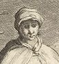</span>
    <span class="fig-name">Melania the Elder</span>
    <span class="fig-period">c. 341–410 CE</span>
    <span class="fig-status status-planned">Planned</span>
  </div>
  <div class="fig-card planned">
    <span class="fig-portrait">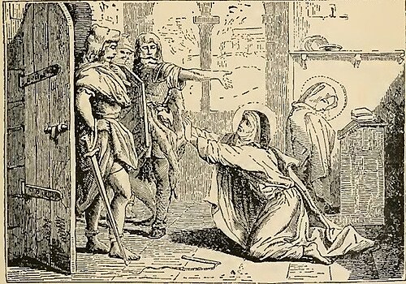</span>
    <span class="fig-name">Marcella of Rome</span>
    <span class="fig-period">c. 325–410 CE</span>
    <span class="fig-status status-planned">Planned</span>
  </div>
  <div class="fig-card planned">
    <span class="fig-medallion">M&amp;P</span>
    <span class="fig-name">Maximilla &amp; Priscilla</span>
    <span class="fig-period">2nd c. CE</span>
    <span class="fig-status status-planned">Planned</span>
  </div>
  <div class="fig-card planned">
    <span class="fig-portrait">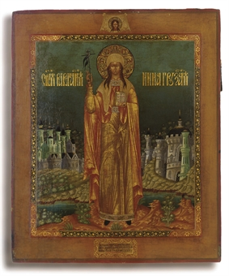</span>
    <span class="fig-name">Nino of Cappadocia</span>
    <span class="fig-period">c. 296–338 CE</span>
    <span class="fig-status status-planned">Planned</span>
  </div>
  <div class="fig-card planned">
    <span class="fig-portrait">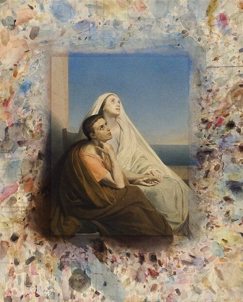</span>
    <span class="fig-name">Monica of Thagaste</span>
    <span class="fig-period">c. 331–387 CE</span>
    <span class="fig-status status-planned">Planned</span>
  </div>
</div>
<button class="fig-nav fig-next" aria-label="Scroll figures right">&#8250;</button>
</div>
<script>
(function () {
  const track = document.getElementById('figCarousel');
  const step = () => {
    const card = track.querySelector('.fig-card');
    return card ? card.offsetWidth + 16 : 240;
  };
  document.querySelector('.fig-prev').addEventListener('click', () =>
    track.scrollBy({ left: -2 * step(), behavior: 'smooth' }));
  document.querySelector('.fig-next').addEventListener('click', () =>
    track.scrollBy({ left: 2 * step(), behavior: 'smooth' }));
})();
</script>
```

## How to cite this project

> Araujo, Eric; Rylaarsdam, D.; Holtrop, Nathan; Hawthorne, Ian. *Matristics: LLM Evaluation in Early Church History*. 2026.
> Available at: ericaraujo.com/matristics
